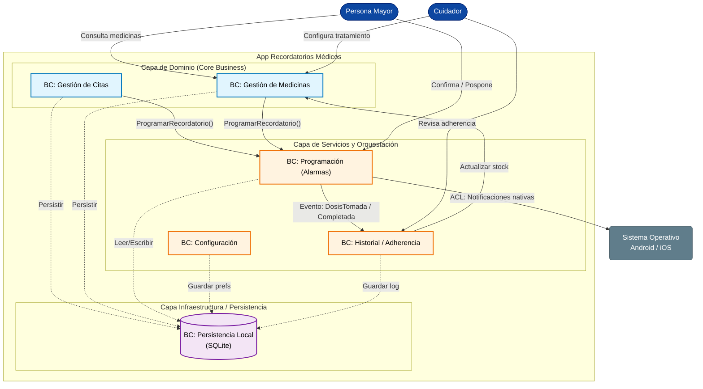

# Datos Informativos

**Nombres:** Jiménez D. Christopher, Altamirano Cristian, Iza Jhordan 
**Asignatura:** Arquitectura de Software
**Curso:** 5 DS “A”
**Fecha:** 22–11–25

---

# CONTEXT MAP & APIs

## Objetivo de la Actividad

El objetivo de esta asignación es aplicar los conceptos de Diseño Estratégico (DDD) para definir los límites lógicos y técnicos del proyecto final. El ejercicio consiste en traducir la estrategia de negocio (el "dominio") al diseño técnico (los "contratos"), mediante la creación del Mapa de Contexto (Context Map), la identificación de las APIs y la documentación formal de sus contratos.

---

# Parte 1: El Mapa de Contexto (Diseño Estratégico)

## 1. Bounded Contexts Identificados

| **Bounded Context**                         | **Descripción**                                                       |
| ------------------------------------------- | --------------------------------------------------------------------- |
| **Gestión de Medicinas**                    | Maneja medicinas: dosis, frecuencia, instrucciones, historial.        |
| **Gestión de Citas Médicas**                | Registra citas, doctor, especialidad, lugar, notas.                   |
| **Programación de Recordatorios (Alarmas)** | Maneja alarmas, notificaciones, horarios y programación local.        |
| **Persistencia Local (SQLite)**             | Abstracción de acceso a datos persistentes.                           |
| **Configuración del Usuario**               | Preferencias del usuario: accesibilidad, sonidos, intervalos, idioma. |
| **Historial / Adherencia**                  | Registra recordatorios completos, omitidos o pospuestos.              |

---
## 1.2. Context Map (Diagrama Descrito)

---  
## Relaciones entre los BC

| **Relación**                                         | **Patrón DDD**         | **Justificación**                                                   |
| ---------------------------------------------------- | ---------------------- | ------------------------------------------------------------------- |
| Gestión de Medicinas → Programación de Recordatorios | **OHS**                | El módulo de alarmas expone servicios para programar recordatorios. |
| Gestión de Citas → Programación de Recordatorios     | **OHS**                | Citas generan recordatorios similares a medicinas.                  |
| Programación de Recordatorios → Persistencia Local   | **ACL**                | Se evita que SQLite "contamine" el dominio de alarmas.              |
| Gestión de Medicinas ↔ Persistencia Local            | **ACL**                | Servicios traducen entidades de dominio a tablas SQLite.            |
| Configuración Usuario → Todos                        | **Shared Kernel (SK)** | Comparten modelos base como preferencias y formatos de hora.        |
| Historial → Programación de Recordatorios            | **OHS**                | Las acciones del usuario afectan recordatorios.                     |

---

# Inventario de APIs (Contratos Internos)

---

## BC: Gestión de Medicinas

| Bounded Context      | API / Recurso | Método | Endpoint                  | Descripción                             | Rol     | 200 OK | Errores  |
| -------------------- | ------------- | ------ | ------------------------- | --------------------------------------- | ------- | ------ | -------- |
| Gestión de Medicinas | Medicinas API | GET    | /medicinas                | Obtiene todas las medicinas registradas | Usuario | 200    | 500      |
| Gestión de Medicinas | Medicinas API | GET    | /medicinas/{id}           | Detalle de una medicina                 | Usuario | 200    | 404, 500 |
| Gestión de Medicinas | Medicinas API | POST   | /medicinas                | Registrar nueva medicina                | Usuario | 201    | 400, 500 |
| Gestión de Medicinas | Medicinas API | PUT    | /medicinas/{id}           | Editar medicina                         | Usuario | 200    | 400, 404 |
| Gestión de Medicinas | Medicinas API | DELETE | /medicinas/{id}           | Eliminar medicina                       | Usuario | 200    | 404, 500 |
| Gestión de Medicinas | Alarmas API   | POST   | /medicinas/{id}/programar | Crear recordatorios para una medicina   | Usuario | 201    | 400, 500 |

---

## BC: Gestión de Citas Médicas

| Bounded Context  | API / Recurso | Método | Endpoint              | Descripción                  | Rol     | 200 OK | Errores  |
| ---------------- | ------------- | ------ | --------------------- | ---------------------------- | ------- | ------ | -------- |
| Gestión de Citas | Citas API     | GET    | /citas                | Listar citas próximas        | Usuario | 200    | 500      |
| Gestión de Citas | Citas API     | GET    | /citas/{id}           | Detalle de una cita          | Usuario | 200    | 404      |
| Gestión de Citas | Citas API     | POST   | /citas                | Crear nueva cita             | Usuario | 201    | 400      |
| Gestión de Citas | Citas API     | PUT    | /citas/{id}           | Editar cita                  | Usuario | 200    | 400, 404 |
| Gestión de Citas | Alarmas API   | POST   | /citas/{id}/programar | Generar recordatorio de cita | Usuario | 201    | 400      |

---

## BC: Programación de Recordatorios (Alarmas)

| Bounded Context | API / Recurso | Método | Endpoint                        | Descripción              | Rol     | 200 OK | Errores  |
| --------------- | ------------- | ------ | ------------------------------- | ------------------------ | ------- | ------ | -------- |
| Alarmas         | Alarmas API   | POST   | /alarmas                        | Programar alarma general | Sistema | 201    | 400, 500 |
| Alarmas         | Alarmas API   | DELETE | /alarmas/{id}                   | Cancelar alarma          | Sistema | 200    | 404      |
| Alarmas         | Alarmas API   | PUT    | /alarmas/{id}/posponer          | Posponer alarma          | Usuario | 200    | 400, 404 |
| Alarmas         | Alarmas API   | PUT    | /alarmas/{id}/marcar-completada | Completar recordatorio   | Usuario | 200    | 404      |

---

## BC: Persistencia Local (SQLite)

Este BC expone contratos técnicos simulados como endpoints.

| Bounded Context | API    | Método | Endpoint   | Descripción               |
| --------------- | ------ | ------ | ---------- | ------------------------- |
| Persistencia    | DB API | POST   | /db/insert | Guardar registro en tabla |
| Persistencia    | DB API | GET    | /db/query  | Consulta SQL              |
| Persistencia    | DB API | PUT    | /db/update | Actualizar registro       |
| Persistencia    | DB API | DELETE | /db/delete | Borrar registro           |

---

## BC: Configuración del Usuario

| Bounded Context       | API        | Método | Endpoint              | Descripción                      |
| --------------------- | ---------- | ------ | --------------------- | -------------------------------- |
| Configuración Usuario | Config API | GET    | /config               | Obtener preferencias             |
| Configuración Usuario | Config API | PUT    | /config               | Actualizar preferencias          |
| Configuración Usuario | Config API | GET    | /config/accesibilidad | Obtener ajustes de accesibilidad |
| Configuración Usuario | Config API | PUT    | /config/accesibilidad | Actualizar accesibilidad         |

---

## BC: Historial / Adherencia

| Bounded Context | API           | Método | Endpoint        | Descripción                             |
| --------------- | ------------- | ------ | --------------- | --------------------------------------- |
| Historial       | Historial API | GET    | /historial      | Consultar historial de recordatorios    |
| Historial       | Historial API | POST   | /historial      | Registrar evento completado / pospuesto |
| Historial       | Historial API | GET    | /historial/{id} | Ver detalle evento                      |

---

# Arquitectura de Soluciones en la Nube (Servidores)

La aplicación móvil está diseñada inicialmente para funcionar de manera offline, utilizando SQLite como base de datos local. Sin embargo, al proyectarse a futuro, es necesario evaluar qué tipo de arquitectura en la nube sería la más adecuada para soportar funcionalidades adicionales como sincronización de datos, respaldo de información, envío de notificaciones inteligentes o interacción entre familiares y médicos.
Bajo este enfoque prospectivo, se analizan tres posibles arquitecturas: Máquinas Virtuales (MV), Contenedores, y Serverless. Después del análisis comparativo, se determina que la opción más adecuada para la evolución natural del proyecto es una arquitectura Serverless, debido a su bajo costo, su alto nivel de disponibilidad y la reducción significativa en la carga operativa.

## 1. Elección de Arquitectura en la Nube
Arquitectura Elegida: Serverless

La arquitectura Serverless resulta ser la alternativa más adecuada para la aplicación debido a que ofrece un entorno flexible, económico y altamente escalable, especialmente útil para proyectos que, aunque actualmente operen sin backend, podrían requerir en el futuro servicios conectados. Entre las funciones futuras contempladas se encuentran:

1. Sincronización de datos entre múltiples dispositivos. 

2. Envío de recordatorios push desde la nube.

3. Respaldo de datos en caso de pérdida del dispositivo.

4. Procesamiento de analíticas o notificaciones inteligentes.

5. Permitir la visualización remota de datos por parte de familiares o médicos.

Una arquitectura Serverless permite habilitar estas capacidades sin necesidad de administrar servidores, proporcionando adicionalmente:

1. Costo extremadamente bajo, ideal para proyectos pequeños.

2. Alta disponibilidad automática, sin requerir infraestructura dedicada.

3. Escalado automático según demanda, sin intervención manual.

4. Seguridad y autenticación integradas mediante servicios como Firebase Auth, AWS Cognito o Azure AD B2C.

5. Carga operativa mínima, ya que no requiere gestionar sistemas operativos, parches o servidores físicos.

Gracias a estas características, Serverless representa una solución óptima para ampliar las capacidades del proyecto sin incrementar innecesariamente su complejidad.

## 2. Justificación de descarte de las otras alternativas

A continuación se presentan las razones por las cuales se descartaron Máquinas Virtuales y Contenedores como arquitecturas principales para el proyecto.

### 2.1 Descarte de Máquinas Virtuales (MV)
| Razón                                         | Justificación                                                                                                    |
| --------------------------------------------- | ---------------------------------------------------------------------------------------------------------------- |
| **Costo alto**                                | La facturación se mantiene incluso cuando los usuarios no interactúan con la app, generando gastos innecesarios. |
| **Mantenimiento elevado**                     | Requiere administrar sistemas operativos, parches de seguridad y configuraciones manuales.                       |
| **Infraestructura sobredimensionada**         | La aplicación no presenta una carga constante que justifique un servidor dedicado.                               |
| **No se alinea con la lógica offline actual** | El proyecto no depende de un backend permanente para funcionar.                                                  |
| **Alta complejidad para un proyecto pequeño** | Necesita personal técnico (DevOps) monitoreando servicios 24/7.                                                  |

### 2.2 Descarte de Contenedores (Docker + Kubernetes)
| Razón                                      | Justificación                                                                                                  |
| ------------------------------------------ | -------------------------------------------------------------------------------------------------------------- |
| **Complejidad innecesaria**                | La orquestación de contenedores requiere clusterización, pipelines CI/CD robustos y administración avanzada.   |
| **Sobrecoste operativo**                   | Plataformas como Kubernetes o ECS representan costos elevados para cargas ligeras.                             |
| **Mantenimiento medio-alto**               | A pesar de ser más sencillo que MV, aún requiere monitoreo, configuraciones y escalamiento manual.             |
| **Poca afinidad con cargas intermitentes** | La aplicación no presenta tráfico constante que justifique un backend contenedorizado.                         |
| **No aporta beneficios adicionales**       | Serverless ya cubre autenticación, triggers, almacenamiento y colas sin necesidad de infraestructura compleja. |

### 2.3 Resultado final

- La tecnología recomendada es Serverless, implementada en servicios como:

- AWS: Lambda + API Gateway + DynamoDB o Aurora Serverless

- Azure: Functions + CosmosDB

- Google Cloud: Cloud Functions + Firestore

- Firebase: (la más compatible con aplicaciones móviles y sincronización en tiempo real)

## 3. Cuadro Comparativo de Arquitecturas
| Criterio                              | Máquinas Virtuales           | Contenedores                           | Serverless (Elegida)            |
| ------------------------------------- | ---------------------------- | -------------------------------------- | ------------------------------- |
| **Costo**                             | Alto (pago continuo)         | Medio (según cluster)                  | Muy bajo (pago por ejecución)   |
| **Complejidad Operativa**             | Alta                         | Media                                  | Muy baja                        |
| **Escalabilidad**                     | Manual                       | Automática, con configuración compleja | Automática por defecto          |
| **Fiabilidad**                        | Depende de configuración     | Alta en clusters bien gestionados      | Muy alta (autoscaling regional) |
| **Seguridad**                         | Administrada por el equipo   | Depende del cluster                    | Gestionada por el proveedor     |
| **Rendimiento**                       | Alto, pero sobredimensionado | Alto                                   | Suficiente y escalable          |
| **Compatibilidad con la app offline** | ❌ No                         | ❌ No                                   | ✔ Sí                            |
| **Mantenimiento**                     | Alto                         | Medio                                  | Muy bajo                        |
| **Ideal para proyectos pequeños**     | ❌                            | ❌                                      | ✔                               |

## 4. Preguntas de Evaluación a Futuro

Las siguientes preguntas permitirán determinar la escalabilidad futura del proyecto, enfocadas en costo, fiabilidad, seguridad, rendimiento y operatividad.

### 4.1 Preguntas sobre Costo

- ¿Cuál sería el costo mensual estimado si el backend Serverless recibiera tráfico de 10.000 usuarios?

- ¿Qué límites gratuitos ofrecen AWS, Azure y Firebase, y cómo impactan al proyecto?

- ¿Qué componentes podrían convertirse en los más costosos: funciones, base de datos, almacenamiento o mensajería?

### 4.2 Preguntas sobre Fiabilidad

- ¿Cuántas regiones geográficas deberían habilitarse para garantizar una disponibilidad del 99.99%?

- ¿Cómo se gestionaría una caída regional del proveedor de nube?

- ¿Es necesario mantener un respaldo local para garantizar continuidad sin internet?

### 4.3 Preguntas sobre Seguridad

- ¿Qué método de autenticación futura será el más adecuado: Firebase Auth, OAuth2 o JWT?

- ¿Cómo se cifrarán los datos sensibles en tránsito y en reposo?

- ¿Se implementará autenticación de doble factor para familiares o médicos?

### 4.4 Preguntas sobre Rendimiento

- ¿Cuál sería la latencia promedio de una función Serverless bajo baja demanda?

- ¿Cómo afecta el cold start a la experiencia del usuario?

- ¿Qué datos deberían sincronizarse en segundo plano para optimizar el rendimiento?

### 4.5 Preguntas sobre Operatividad

- ¿Qué métricas se recolectarán para mejorar la calidad del servicio?

- ¿Cómo se gestionarán los errores silenciosos como fallas de red o corrupción de datos locales?

- ¿Qué política de backup se implementará para la base de datos en la nube?

## 5. Estrategia de Despliegue Recomendada
Aunque una arquitectura Serverless no opere con servidores tradicionales, sigue siendo necesario definir una estrategia de despliegue para garantizar actualizaciones seguras y controladas.

### Estrategia Elegida: Canary Deployment

- El despliegue canario permite liberar una nueva versión de una función o servicio a un pequeño porcentaje de usuarios antes de expandirla al resto. Esta estrategia es ideal para servicios Serverless, ya que:

- Minimiza riesgos al introducir cambios gradualmente.

- Permite detectar errores o comportamientos inesperados sin afectar a toda la base de usuarios.

- Resulta especialmente valiosa en aplicaciones relacionadas con recordatorios médicos, donde un error podría comprometer la salud del usuario.

**Ejemplo de despliegue en etapas**

1. Se lanza una nueva versión del sistema de notificaciones.

2. Solo el 5–10% de los usuarios comienza a utilizarla.

3. Si no se detectan errores, se amplía al 50%.

4. Finalmente, se publica al 100% de los usuarios.

### Por qué no se eligió Blue/Green

- Es una estrategia diseñada para infraestructuras con servidores completos.

- Requiere mantener dos entornos completos funcionando simultáneamente, lo que duplica costos.

- No aporta beneficios adicionales en arquitecturas Serverless, donde las versiones coexisten naturalmente.

### Por qué no se eligió Rolling Update

- Este método es ideal para contenedores en plataformas como Kubernetes.

- No se adapta bien a funciones Serverless, que operan de forma aislada y no pertenecen a un clúster tradicional.

- No permite el grado de control fino que sí ofrece el despliegue canario.